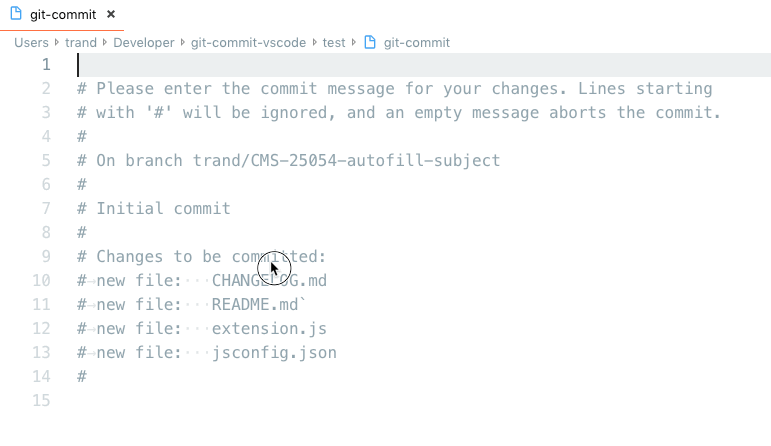

# Git Commit Message (Visual Studio Code Extension)

Provides some useful helpers for writing a git commit message.

## Features

- **Validate and format** the git commit subject text
- **Auto-fill subject text** with information from branch name
- **Display the remaining characters** until the commit subject max length is met

## Configuration

This extension can be configured in User Settings or Workspace settings.

`"git-commit.autoselectEndOfSubject": true`  
 Whether or not to auto-select the end of the commit subject.

`"git-commit.subjectFormat.enableFormatter": true`  
 Lint and format the commit subject using information from the branch name.

`"git-commit.subjectFormat.template": "[$0] $1"`  
 Template with indexed placeholders (e.g. `$0`..`$N`). Must be valid against the subject format linter rule.

`"git-commit.subjectFormat.linterRegex": "^\\[((?:[A-Z]+-\\d+)(?:, [A-Z]+-\\d+)*)?\\] (.*)"`  
 Regular expression to lint the commit subject.

`"git-commit.subjectFormat.branchRegex": "^\\w+\\/(CMS-\\d+)(?:-.*)"`  
 Regular expression to capture data groups from the current branch name, used to fill the data points of the placeholder.

`"git-commit.subjectFormat.displayCharactersRemaining": true`  
 Display the characters remaining before the subject's max length is met.

`"git-commit.subjectFormat.charactersRemainingTextColor": "rgba(153, 153, 153, 0.35)"`  
 The text color of the characters remaining indicator.

`"git-commit.subjectFormat.maxLength": 72`  
 The maximum length of the git commit subject text.

## Known Issues

No currently known issues. Please open a ticket on GitHub for any bugs.

## Release Notes

Release notes for all versions can be found in the [changelog](CHANGELOG.md).
